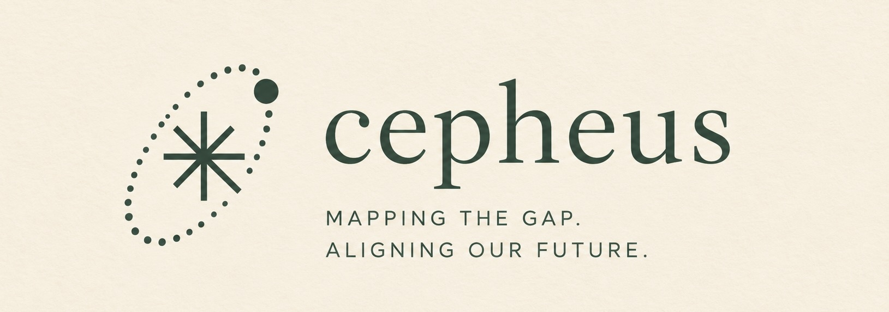

  

Cepheus is a personal home for essays and projects on technology, policy, and global affairs. The work here is mostly concerned with the places where technical systems, public institutions, and political judgment begin to overlap. Essays are written to stand on their own, with interactive figures used where they help make an argument easier to see.

The Cepheus homepage is deliberately simple. Click anywhere on the page to leave a watercolor node. Each new point is connected to the one before it, gradually creating a small network across the page. It is a visual introduction to a recurring idea across the work hosted here: knowledge rarely exists in isolation; what matters is how the pieces connect.

[Visit Cepheus](https://cepheus-pons.org/)

## Essays

### What We Owe to Each Other

An essay about the growing distance between the institutions building advanced AI and the institutions expected to govern it.
Beginning with the Anthropic–Pentagon dispute, the essay asks who holds technical knowledge, who holds public authority, and what happens when those responsibilities sit in different places. Interactive maps and instruments accompany the argument to make those institutional gaps easier to inspect.

[Read the essay](https://cepheus-pons.org/essays/what-we-owe-to-each-other)

## Projects

### Writ

**A domain-specific language for global affairs.**

Writ is an open-source pilot for turning political, legal, and institutional research into structured, traceable knowledge.
The broader aim is to make the same body of policy knowledge legible in two directions: readable by researchers and policymakers, while also structured enough for engineers and software to inspect and build on. It preserves provenance, uncertainty, and disagreement rather than reducing political judgment to code.

[Visit Writ](https://writewrit.vercel.app/) · [GitHub](https://github.com/saykig/Writ)

## Institutional research and development

The essay now includes a bounded constellation with separately reviewed observations, qualitative attributes and analytical assessments. The current release is **1.0.0-rc.1**, pending author editorial sign-off.

- [Research methodology](research/METHODOLOGY.md), [record contract](research/SCHEMA.md), [canonical data](research/data/), [preserved v0.1](research/releases/v0.1/).
- [Design](docs/DESIGN.md), [product](docs/PRODUCT.md), [retired research](docs/archive/).
- [Public evidence index](https://cepheus-pons.org/institutional-links) provides published findings and their provenance.

Run `pnpm install`, then `pnpm dev` for the local preview. `pnpm research:validate` checks canonical research; `pnpm research:export` builds the approved publication bundle and deterministic D3 coordinates. `pnpm test`, `pnpm typecheck`, `pnpm build` and `pnpm test:e2e` cover research and reading behavior. Browser setup: `pnpm exec playwright install chromium webkit`.

Active export tooling lives in `internal/tooling/`. Root `public/` is the Next.js runtime directory and contains the generated publication bundle, essay citation registry and brand assets. Canonical research and archived material are not served as runtime datasets. No obsolete synthetic-data generator is part of the build.

Tests live in [internal/tests](internal/tests/); export tooling lives in
[internal/tooling](internal/tooling/). See the [current constellation contract](docs/CONSTELLATION-V2.md)
and [cleanup audit](research/audit/repository-cleanup.md) for retained/deleted material.
